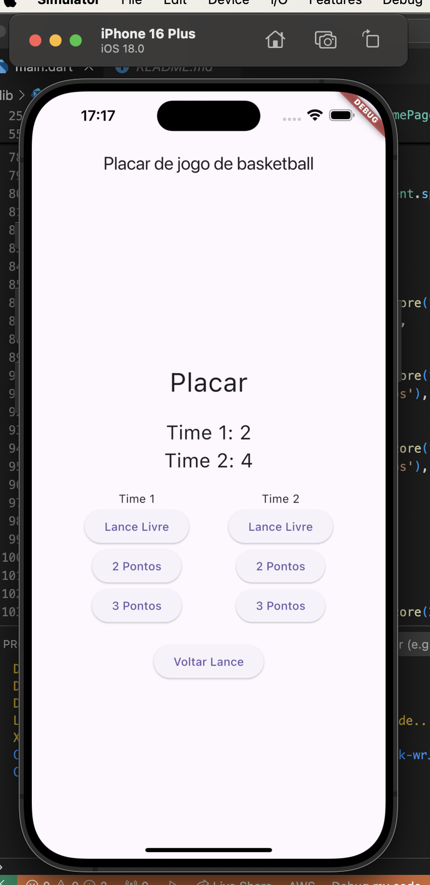

# i_placcar

Este é um aplicativo Flutter simples para contar os pontos de dois times de basquete. Ele permite que você adicione pontos para cada time e desfaça o último lance realizado.

## Capturas de Tela

## Funcionalidades

- *Placar*: Exibe o placar atual dos dois times.
- *Botões de Pontuação*: Cada time tem três botões para adicionar pontos:
  - Lance Livre (1 ponto)
  - 2 Pontos
  - 3 Pontos
- *Botão "Voltar Lance"*: Desfaz o último lance realizado. Este botão é desabilitado se não houver lances para desfazer.